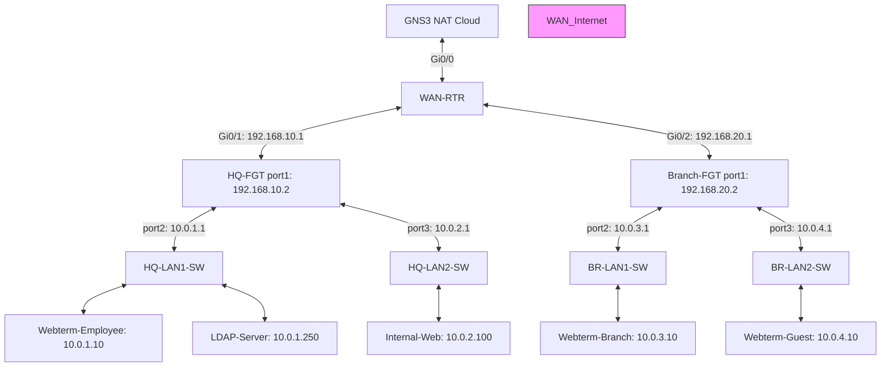

# 🏗️ GNS3 Enterprise Sandbox: Spiced-Up Multi-Firewall & WAN Router

This guide outlines how to build a realistic, enterprise-grade multi-site network simulating an **ISP/WAN Router hop**, **Headquarters (HQ)** with two subnets, and a **Branch Office** with two subnets.

Both firewalls are kept strictly within their **3-interface evaluation license limits**, while the central router handles WAN distribution.

---

## 🖥️ GNS3 Node Inventory

Drag the following nodes into your GNS3 workspace:

| Node Name | Template / Type | Network Function | GNS3 Interface Mapping |
| :--- | :--- | :--- | :--- |
| **NAT1** | Built-in NAT Cloud | Internet Access | Connect to `WAN-RTR` `Gi0/0` |
| **WAN-RTR** | Cisco Router / VyOS | ISP WAN Edge Router | `Gi0/0`: WAN (DHCP)<br>`Gi0/1`: link to HQ (`192.168.10.1/24`)<br>`Gi0/2`: link to Branch (`192.168.20.1/24`) |
| **HQ-FGT** | FortiGate (QEMU) | HQ Security Gateway | `port1`: WAN (`192.168.10.2/24`)<br>`port2`: HQ LAN 1 (`10.0.1.1/24`)<br>`port3`: HQ LAN 2 (`10.0.2.1/24`) |
| **HQ-LAN1-SW** | Ethernet Switch | HQ LAN 1 Switch | Connect to `HQ-FGT` `port2` |
| **Webterm-Employee**| Webterm (Docker VNC) | Staff Desktop (HQ) | Connect to `HQ-LAN1-SW` |
| **LDAP-Server** | VPCS (Built-in) | HQ Active Directory Server | Connect to `HQ-LAN1-SW` |
| **HQ-LAN2-SW** | Ethernet Switch | HQ LAN 2 Switch | Connect to `HQ-FGT` `port3` |
| **Internal-Web** | Webterm (Docker VNC) | Corporate Web Server | Connect to `HQ-LAN2-SW` |
| **Branch-FGT** | FortiGate (QEMU) | Branch Security Gateway | `port1`: WAN (`192.168.20.2/24`)<br>`port2`: Branch LAN 1 (`10.0.3.1/24`)<br>`port3`: Branch LAN 2 (`10.0.4.1/24`) |
| **BR-LAN1-SW** | Ethernet Switch | Branch LAN 1 Switch | Connect to `Branch-FGT` `port2` |
| **Webterm-Branch** | Webterm (Docker VNC) | Staff Desktop (Branch) | Connect to `BR-LAN1-SW` |
| **BR-LAN2-SW** | Ethernet Switch | Branch LAN 2 Switch | Connect to `Branch-FGT` `port3` |
| **Webterm-Guest** | Webterm (Docker VNC) | Guest Desktop (Branch) | Connect to `BR-LAN2-SW` |

---

## 🗺️ Physical and Logical Topology

### Logical Subnets:
*   **HQ LAN 1 (port2):** `10.0.1.0/24` (Employees / Gateway: `10.0.1.1`)
*   **HQ LAN 2 (port3):** `10.0.2.0/24` (Servers / Gateway: `10.0.2.1`)
*   **Branch LAN 1 (port2):** `10.0.3.0/24` (Branch Users / Gateway: `10.0.3.1`)
*   **Branch LAN 2 (port3):** `10.0.4.0/24` (Branch Guests / Gateway: `10.0.4.1`)
*   **WAN Link HQ:** `192.168.10.0/24` (HQ `port1`: `192.168.10.2` <-> Router `Gi0/1`: `192.168.10.1`)
*   **WAN Link Branch:** `192.168.20.0/24` (Branch `port1`: `192.168.20.2` <-> Router `Gi0/2`: `192.168.20.1`)

### Wiring Schematics:



---

## ⚙️ Step-by-Step Configuration

### Phase 1: WAN Edge Router Configuration
We configure IP addresses, routing, and NAT on the central OpenWrt router.

1.  **Configure Network Interfaces:**
    Open the terminal console of the **WAN-RTR** (OpenWrt) node and run these UCI commands:
    ```bash
    # 1. Configure WAN (eth0)
    uci set network.wan=interface
    uci set network.wan.device='eth0'
    uci set network.wan.proto='dhcp'

    # 2. Configure HQ link (eth1)
    uci set network.hq=interface
    uci set network.hq.device='eth1'
    uci set network.hq.proto='static'
    uci set network.hq.ipaddr='192.168.10.1'
    uci set network.hq.netmask='255.255.255.0'

    # 3. Configure Branch link (eth2)
    uci set network.branch=interface
    uci set network.branch.device='eth2'
    uci set network.branch.proto='static'
    uci set network.branch.ipaddr='192.168.20.1'
    uci set network.branch.netmask='255.255.255.0'

    # Commit changes and restart network service
    uci commit network
    /etc/init.d/network restart
    ```

2.  **Configure Firewall Zones & NAT (Masquerading):**
    By default, OpenWrt blocks forwarding between interface zones. We must allow forwarding and enable NAT on the WAN port:
    ```bash
    # Create lan zone for internal links (HQ and Branch)
    uci set firewall.lan=zone
    uci set firewall.lan.name='lan'
    uci set firewall.lan.input='ACCEPT'
    uci set firewall.lan.output='ACCEPT'
    uci set firewall.lan.forward='ACCEPT'
    uci add_list firewall.lan.device='eth1'
    uci add_list firewall.lan.device='eth2'

    # Enable masquerading (NAT) on WAN zone
    uci set firewall.wan.masq='1'

    # Allow LAN to WAN forwarding
    uci set firewall.lan_wan=forwarding
    uci set firewall.lan_wan.src='lan'
    uci set firewall.lan_wan.dest='wan'

    # Commit and restart firewall service
    uci commit firewall
    /etc/init.d/firewall restart
    ```

---

### Phase 2: HQ Firewall Configuration

1.  **Configure HQ Interfaces on HQ-FGT CLI:**
    ```text
    config system interface
        # WAN link to Router
        edit port1
            set ip 192.168.10.2 255.255.255.0
            set allowaccess ping
        next
        
        # HQ LAN 1 (Employees)
        edit port2
            set ip 10.0.1.1 255.255.255.0
            set allowaccess ping https ssh http
        next
        
        # HQ LAN 2 (Servers)
        edit port3
            set ip 10.0.2.1 255.255.255.0
            set allowaccess ping
        next
    end
    ```

2.  **Configure Default Static Route to WAN Router:**
    ```text
    config router static
        edit 1
            set gateway 192.168.10.1
            set device "port1"
        next
    end
    ```

3.  **Client IP Configurations:**
    *   **Webterm-Employee:** IP `10.0.1.10/24`, Gateway `10.0.1.1`
    *   **LDAP-Server (VPCS):**
        ```text
        ip 10.0.1.250 10.0.1.1 24
        save
        ```
    *   **Internal-Web (WebServer):** IP `10.0.2.100/24`, Gateway `10.0.2.1`

---

### Phase 3: Branch Firewall Configuration

1.  **Configure Branch Interfaces on Branch-FGT CLI:**
    ```text
    config system interface
        # WAN link to Router
        edit port1
            set ip 192.168.20.2 255.255.255.0
            set allowaccess ping
        next
        
        # Branch LAN 1 (Employees)
        edit port2
            set ip 10.0.3.1 255.255.255.0
            set allowaccess ping https ssh http
        next
        
        # Branch LAN 2 (Guests)
        edit port3
            set ip 10.0.4.1 255.255.255.0
            set allowaccess ping
        next
    end
    ```

2.  **Configure Default Static Route to WAN Router:**
    ```text
    config router static
        edit 1
            set gateway 192.168.20.1
            set device "port1"
        next
    end
    ```

3.  **Client IP Configurations:**
    *   **Webterm-Branch:** IP `10.0.3.10/24`, Gateway `10.0.3.1`
    *   **Webterm-Guest:** IP `10.0.4.10/24`, Gateway `10.0.4.1`

---

### Phase 4: OSPF Dynamic Routing
Run OSPF across `HQ-FGT`, `Branch-FGT`, and `WAN-RTR` so they dynamically build network routing paths.

1.  **OSPF Config on HQ-FGT:**
    ```text
    config router ospf
        config area
            edit 0.0.0.0
            next
        end
        config network
            edit 1
                set prefix 192.168.10.0 255.255.255.0
                set area 0.0.0.0
            next
            edit 2
                set prefix 10.0.1.0 255.255.255.0
                set area 0.0.0.0
            next
            edit 3
                set prefix 10.0.2.0 255.255.255.0
                set area 0.0.0.0
            next
        end
    end
    ```

2.  **OSPF Config on Branch-FGT:**
    ```text
    config router ospf
        config area
            edit 0.0.0.0
            next
        end
        config network
            edit 1
                set prefix 192.168.20.0 255.255.255.0
                set area 0.0.0.0
            next
            edit 2
                set prefix 10.0.3.0 255.255.255.0
                set area 0.0.0.0
            next
            edit 3
                set prefix 10.0.4.0 255.255.255.0
                set area 0.0.0.0
            next
        end
    end
    ```

3.  **OSPF Config on WAN-RTR (OpenWrt - FRRouting):**
    If your OpenWrt image has **FRRouting (FRR)** installed, you can enter the Cisco-like VTY shell to configure OSPF:
    ```text
    vtysh
    configure terminal
    router ospf
      network 192.168.10.0/24 area 0
      network 192.168.20.0/24 area 0
    ```
    *Tip: If you prefer editing FRR configuration files directly, append the OSPF configuration to `/etc/frr/frr.conf`:*
    ```text
    router ospf
     network 192.168.10.0/24 area 0
     network 192.168.20.0/24 area 0
    ```

---

### Phase 5: Firewall Security Policies
Permit outbound internet access and site-to-site communication.

1.  **HQ Security Policies (HQ-FGT CLI):**
    ```text
    config firewall policy
        # 1. LAN 1 to WAN (Internet)
        edit 10
            set name "HQ_LAN1_to_Internet"
            set srcintf "port2"
            set dstintf "port1"
            set action accept
            set srcaddr "all"
            set dstaddr "all"
            set schedule "always"
            set service "ALL"
            set nat enable
        next

        # 2. LAN 2 to WAN (Internet)
        edit 11
            set name "HQ_LAN2_to_Internet"
            set srcintf "port3"
            set dstintf "port1"
            set action accept
            set srcaddr "all"
            set dstaddr "all"
            set schedule "always"
            set service "ALL"
            set nat enable
        next

        # 3. Inter-Site LAN-to-LAN routing rules (Without NAT)
        edit 20
            set name "Site_to_Site_In"
            set srcintf "port1"
            set dstintf "port2" "port3"
            set action accept
            set srcaddr "all"
            set dstaddr "all"
            set schedule "always"
            set service "ALL"
        next
        edit 21
            set name "Site_to_Site_Out"
            set srcintf "port2" "port3"
            set dstintf "port1"
            set action accept
            set srcaddr "all"
            set dstaddr "all"
            set schedule "always"
            set service "ALL"
        next
    end
    ```

2.  **Branch Security Policies (Branch-FGT CLI):**
    ```text
    config firewall policy
        # 1. LAN 1 (Employees) to Internet
        edit 10
            set name "Branch_LAN1_to_Internet"
            set srcintf "port2"
            set dstintf "port1"
            set action accept
            set srcaddr "all"
            set dstaddr "all"
            set schedule "always"
            set service "ALL"
            set nat enable
        next

        # 2. LAN 2 (Guests) to Internet
        edit 11
            set name "Branch_LAN2_to_Internet"
            set srcintf "port3"
            set dstintf "port1"
            set action accept
            set srcaddr "all"
            set dstaddr "all"
            set schedule "always"
            set service "ALL"
            set nat enable
        next

        # 3. Inter-Site LAN-to-LAN routing rules (Without NAT)
        edit 20
            set name "Site_to_Site_In"
            set srcintf "port1"
            set dstintf "port2" "port3"
            set action accept
            set srcaddr "all"
            set dstaddr "all"
            set schedule "always"
            set service "ALL"
        next
        edit 21
            set name "Site_to_Site_Out"
            set srcintf "port2" "port3"
            set dstintf "port1"
            set action accept
            set srcaddr "all"
            set dstaddr "all"
            set schedule "always"
            set service "ALL"
        next
    end
    ```

---

## 🔍 Verification & Diagnostics Challenges

1.  **Verify OSPF Neighbors:**
    On both firewalls: `get router info ospf neighbor`. On the WAN Router: `show ip ospf neighbor`. You should see adjacencies established.
2.  **Check Learned Routes:**
    Check `get router info routing-table ospf` on HQ. You should see Branch LANs (`10.0.3.0/24` and `10.0.4.0/24`) learned dynamically.
3.  **Trace End-to-End Pings:**
    From `Webterm-Employee` (`10.0.1.10`), ping `Webterm-Branch` (`10.0.3.10`). Run traces to verify packets traverse the ISP router (`192.168.10.1` -> `192.168.20.2`).
4.  **Save Configurations:**
    Make sure to backup your running settings on both firewalls using the baselines in [[HQ_FGT_Base.conf]].
